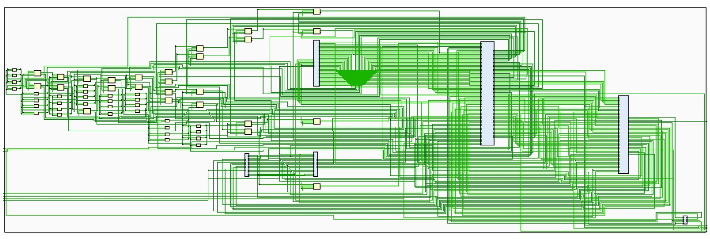

## A Harvard-structure CPU which supports 31 Mips instructions

## Brief Intro

This is a super-tiny toy CPU with ```Harvard-structure``` which can support 31 ```Mips``` instructions. All instructions are executed within one period thus ```pipeline technique``` is **not** utilized. It is also submitted as a mid-term project for *Tongji University* *CS 101016* course. 


## Platforms and devices

+ ```Visual Studio Code``` with ```iverilog``` and ```gtkwave```
+ ```vivado 2016.2```
+ DIGILENT Nexys4 DDR™ FPGA Board


## RTL schemantic




## IO relationship for each instruction

| instruction |    PC     | NPC  | IMEM | DMEM addr | Dmem  data |   RegFile    | ALU op1 | ALU op2  | Ex5_32 | Ex16_32 | Ex18_32   | ADD1  op1 | ADD1 op2 | ADD2 op1 | ADD2 op2 | \|\| op1  | \|\| op2         |
| :---------: | :-------: | :--: | :--: | --------- | ---------- | :----------: | :-----: | :------: | ------ | ------- | --------- | --------- | -------- | -------- | -------- | --------- | ---------------- |
|     add     | NPC->MUX  |  PC  |  PC  |           |            |     ALU      |   Rs    |    Rt    |        |         |           |           |          |          |          |           |                  |
|    addu     | NPC->MUX  |  PC  |  PC  |           |            |     ALU      |   Rs    |    Rt    |        |         |           |           |          |          |          |           |                  |
|     sub     | NPC->MUX  |  PC  |  PC  |           |            |     ALU      |   Rs    |    Rt    |        |         |           |           |          |          |          |           |                  |
|    subu     | NPC->MUX  |  PC  |  PC  |           |            |     ALU      |   Rs    |    Rt    |        |         |           |           |          |          |          |           |                  |
|     and     | NPC->MUX  |  PC  |  PC  |           |            |     ALU      |   Rs    |    Rt    |        |         |           |           |          |          |          |           |                  |
|     or      | NPC->MUX  |  PC  |  PC  |           |            |     ALU      |   Rs    |    Rt    |        |         |           |           |          |          |          |           |                  |
|     xor     | NPC->MUX  |  PC  |  PC  |           |            |     ALU      |   Rs    |    Rt    |        |         |           |           |          |          |          |           |                  |
|     nor     | NPC->MUX  |  PC  |  PC  |           |            |     ALU      |   Rs    |    Rt    |        |         |           |           |          |          |          |           |                  |
|     slt     | NPC->MUX  |  PC  |  PC  |           |            |   ALU->MUX   |   Rs    |    Rt    |        |         |           |           |          |          |          |           |                  |
|    sltu     | NPC->MUX  |  PC  |  PC  |           |            |   ALU->MUX   |   Rs    |    Rt    |        |         |           |           |          |          |          |           |                  |
|     sll     | NPC->MUX  |  PC  |  PC  |           |            |     ALU      | Ex5_32  |    Rt    | sa     |         |           |           |          |          |          |           |                  |
|     srl     | NPC->MUX  |  PC  |  PC  |           |            |     ALU      | Ex5_32  |    Rt    | sa     |         |           |           |          |          |          |           |                  |
|     sra     | NPC->MUX  |  PC  |  PC  |           |            |     ALU      | Ex5_32  |    Rt    | sa     |         |           |           |          |          |          |           |                  |
|    sllv     | NPC->MUX  |  PC  |  PC  |           |            |     ALU      | Ex5-32  |    Rt    | Rs     |         |           |           |          |          |          |           |                  |
|    srlv     | NPC->MUX  |  PC  |  PC  |           |            |     ALU      | Ex5-32  |    Rt    | Rs     |         |           |           |          |          |          |           |                  |
|    srav     | NPC->MUX  |  PC  |  PC  |           |            |     ALU      | Ex5-32  |    Rt    | Rs     |         |           |           |          |          |          |           |                  |
|     jr      |  Rs->MUX  |  PC  |  PC  |           |            |              |         |          |        |         |           |           |          |          |          |           |                  |
|    addi     | NPC->MUX  |  PC  |  PC  |           |            |   ALU->Rt    |   Rs    | Ext16_32 |        | imm     |           |           |          |          |          |           |                  |
|    addiu    | NPC->MUX  |  PC  |  PC  |           |            |   ALU->Rt    |   Rs    | Ext16_32 |        | imm     |           |           |          |          |          |           |                  |
|    andi     | NPC->MUX  |  PC  |  PC  |           |            |   ALU->Rt    |   Rs    | Ext16_32 |        | imm     |           |           |          |          |          |           |                  |
|     ori     | NPC->MUX  |  PC  |  PC  |           |            |   ALU->Rt    |   Rs    | Ext16_32 |        | imm     |           |           |          |          |          |           |                  |
|    xori     | NPC->MUX  |  PC  |  PC  |           |            |   ALU->Rt    |   Rs    | Ext16_32 |        | imm     |           |           |          |          |          |           |                  |
|     lui     | NPC->MUX  |  PC  |  PC  |           |            |   ALU->Rt    |   Rs    | Ext16_32 |        | imm     |           |           |          |          |          |           |                  |
|     lw      | NPC->MUX  |  PC  |  PC  | ALU       |            |   dmem->Rt   |   Rs    | Ext16_32 |        | imm     |           |           |          |          |          |           |                  |
|     sw      | NPC->MUX  |  PC  |  PC  | ALU       | Rt         |              |   Rs    | Ext16_32 |        | imm     |           |           |          |          |          |           |                  |
|     beq     | ADD1->MUX |  PC  |  PC  |           |            |              |   Rs    |    Rt    |        |         | imm\|\|00 | NPC       | Ex18_32  |          |          |           |                  |
|     bne     | ADD1->MUX |  PC  |  PC  |           |            |              |   Rs    |    Rt    |        |         | imm\|\|00 | NPC       | Ex18_32  |          |          |           |                  |
|    slti     | NPC->MUX  |  PC  |  PC  |           |            | ALU->MUX->Rt |   Rs    | Ext16_32 |        | imm     |           |           |          |          |          |           |                  |
|    sltiu    | NPC->MUX  |  PC  |  PC  |           |            | ALU->MUX->Rt |   Rs    | Ext16_32 |        | imm     |           |           |          |          |          |           |                  |
|      j      | \|\|->MUX |  PC  |  PC  |           |            |              |         |          |        |         |           |           |          |          |          | PC[31:28] | IMEM[25:0]\|\|02 |
|     jal     | \|\|->MUX |  PC  |  PC  |           |            |  ADD2->$31   |         |          |        |         |           |           |          | PC       | 8        | PC[31:28] | IMEM[25:0]\|\|02 |

+ additional notes
  - ```slt```: we directly compute the result in ```ALU```.
  - ```sllv``` : though the value we get from ```Rs``` is already 32 bit , we want to restrain it to 0-31, so we pass the lowest 5 bits to ```Ext5-16```.
  - ```lui``` : we do not use ```Rs``` register here, just for the consistency with other instructions.
  - ```Ext16_32``` : this component can perform both zero-extend and signed-extend.
  - ```jal``` : the address restored in ```$31``` depends on the specific standard of ```Mips``` .

## Milestones

- 2023-5-7 21:20  :  **Functional simulation** passes.
- 2023-5-9 16:20  :  **post-synthesis simulation** passes.
- 2023-5-9 16:23  :  generate bit stream to **FPGA board** successfully. 


## How to change a ```vivado``` project into lovely ```VScode```

+ substitute ```IP core``` with our hand-written ```imem_module.v```

+ delete the head lines starting with ```include``` for ```vivado``` will build hierarchy automatically. 

+ mend ```cputb.v``` ,delete following lines:

  ```verilog
  initial
  begin
      $dumpfile("cpu.vcd");
      $dumpvars;
      #2000;
      $finish;
  end
  
  ```
  

## Acknowledgement

Special thanks for this [blog](https://skyleaworlder.github.io/2020/06/18/CPU31/), it was very helpful for this project .


## Contact me

I have attached the ```timing report```, if you have a good way to optimize the datapath and would like to share it, please feel free to contact me.
